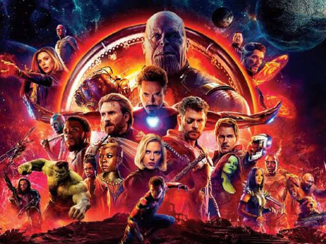

# Using Spacy to analyze Avengers Infinity War Dialogues

This exercise attempts to reproduce the results from https://towardsdatascience.com/reliving-avengers-infinity-war-with-spacy-and-natural-language-processing-2abcb48e4ba1 and on top of it perform a **Latent Semantic Analysis** to extract the top 10 topics and the words from the top 10 topics.

Firstly, I used **Beautiful Soup** in order to extract the text from https://transcripts.fandom.com/wiki/Avengers:_Infinity_War. I extracted both the Author and the dialogue separately, removed all the action scenes eg. "Loki stands up", "Thor lifts the stormbreaker" etc. and kept only that text which the characters speak to one another.

Next, I used Spacy which is an Industrial-Strength Natural Language Processing framework in python to find out the top 10 nouns, verbs, adjectives and adverbs that occur over the course of the film and also wrt individual characters. 

Using the **document similarity feature in Spacy** I found out which characters are similar to one another and eventually I performed a latent semantic analysis using **TruncatedSVD** in python to get the top 10 topics and 5 most frequently occuring words in those 10 topics.
